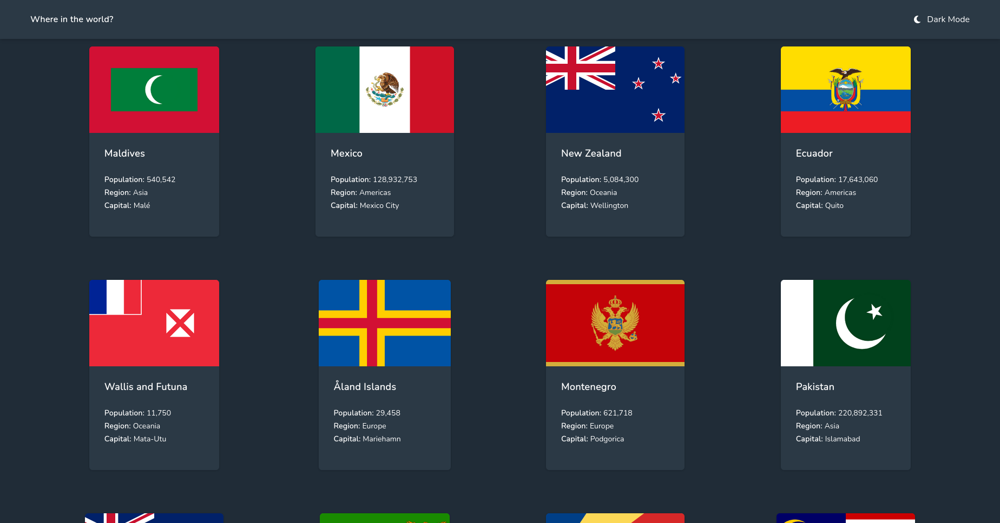
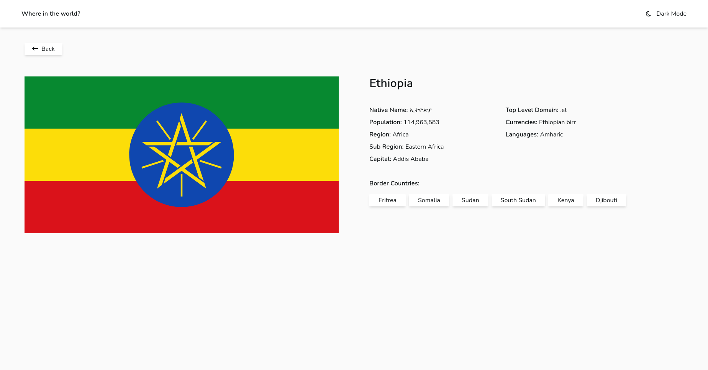
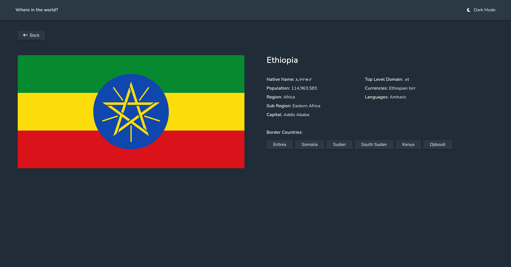
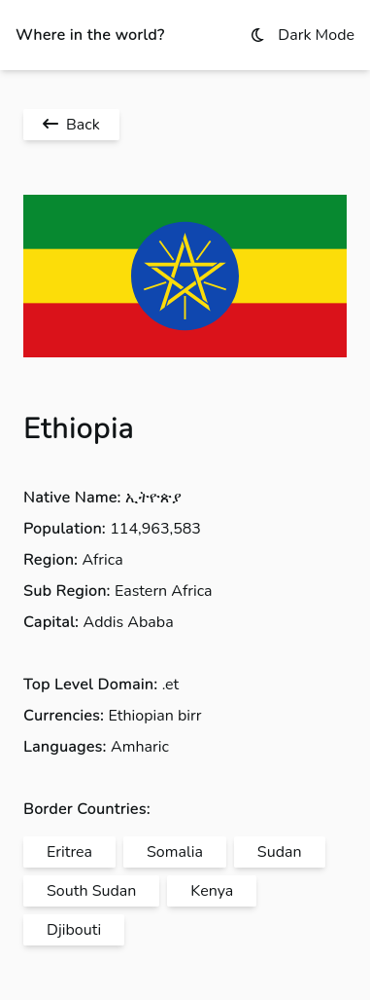
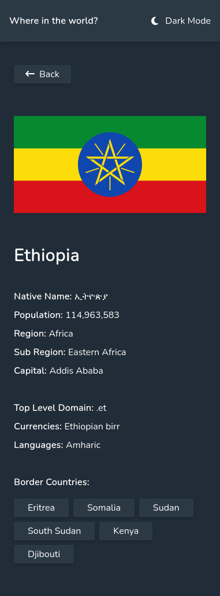

# Frontend Mentor - REST Countries API with color theme switcher solution

This is a solution to the [REST Countries API with color theme switcher challenge on Frontend Mentor](https://www.frontendmentor.io/challenges/rest-countries-api-with-color-theme-switcher-5cacc469fec04111f7b848ca). Frontend Mentor challenges help you improve your coding skills by building realistic projects.

## Table of contents

- [Overview](#overview)
  - [The challenge](#the-challenge)
  - [Screenshot](#screenshot)
  - [Links](#links)
- [My process](#my-process)
  - [Built with](#built-with)
  - [Continued development](#continued-development)
  - [Useful resources](#useful-resources)
- [Author](#author)

## Overview

### The challenge

Users should be able to:

- See all countries from the API on the homepage
- Search for a country using an `input` field
- Filter countries by region
- Click on a country to see more detailed information on a separate page
- Click through to the border countries on the detail page
- Toggle the color scheme between light and dark mode _(optional)_

### Screenshot

### Links

- Solution URL: [Add solution URL here](https://your-solution-url.com)
- Live Site URL: [Add live site URL here](https://your-live-site-url.com)

## My process

### Built with

- Semantic HTML5 markup
- Flexbox
- CSS Grid
- Mobile-first workflow
- [Tailwind](https://tailwindcss.com/) - utility-first CSS framework
- [TypeScript](https://www.typescriptlang.org/)- strongly typed programming language that builds on JavaScript
- [React](https://reactjs.org/) - JS library
- [React Router](https://nextjs.org/) - Standard library routing in React

### Continued development

I want to take this project beyond the requirements to use all the features available by the api.

### Useful resources

- [Custom dropdown menu](https://www.youtube.com/watch?v=TQFW3AtrDw4) - This Course taught me how to design custom dropdown menu using tailwind. I really liked fixed positioning of the button to emulate closing of the dropdown.

## Author

- Frontend Mentor - [@Mirtineh](https://www.frontendmentor.io/profile/Mirtineh)
